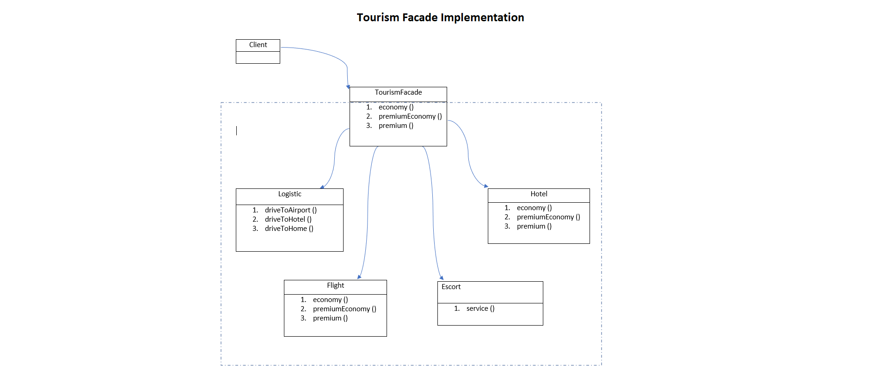

**Facade Pattern**
The Facade Pattern provides a unifi ed interface to a set of interfaces in a subsytem. Facade defi nes a higher-level interface that makes the subsystem easier to use.

**Design Principle**

1. When you need to simplify and unify a large interface or complex set of interfaces, use a facade.
2. A facade decouples a client from a complex subsystem
3. Implementing a facade requires that we compose the facade with its subsystem and use delegation to perform the work of the facade.
4. Principle of Least Knowledge - talk only to your immediate friends.

**Tourism Facade Control**

**Idle Flow**
1. The client only has one friend; the TourismFacade. In OO programming, having only one friend is a GOOD thing (Principle of Least Knowledge).
2. The TourismFacade manages all those subsystem components for the client. It keeps the client simple and flexible.
3. We can upgrade the Tourism components without affecting the client .

