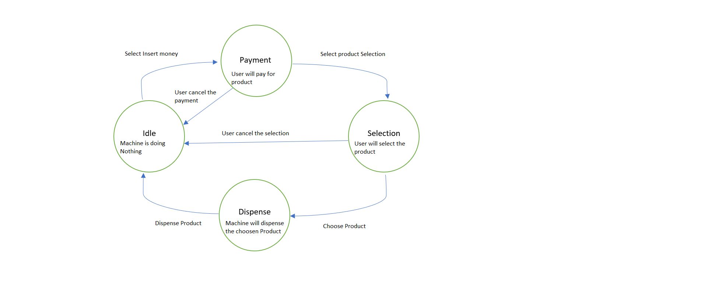

**State Design Pattern**

State is a behavioral design pattern that lets an object alter its behavior when its internal state changes. It appears as if the object changed its class.

The State pattern is closely related to the concept of a Finite-State Machine 

The State Pattern allows an object to alter its behavior when its internal state changes. The object will appear to change its class.

1. First, we’re going to define a State interface that contains a method for every action in the Vending Machine.

2. Then we’re going to implement a State class for  every state of the machine. These classes will be  responsible for the behavior of the machine when it is in the corresponding state.

**Vending Machine**

**Idle Steps:**

 1. Machine is in **Idle State**
 2. User will press the button to start the payment
 3. Machine will enter the **Payment State**, now ready to accept payment
 4. User will pay the amount
 5. After Payment User will press the button to start the product selection
 6. Machine will enter the **Selection State**, and be ready to accept the product code.
 7. User will enter the code
 8. Machine will enter the **Dispense State**, and will dispense the product, and change is required
 9. After Dispense, Machine will again enter the **Idle State** and be ready to accept new orders.

**Not So idle scenarios**

**Case 1: User deposit less money**
    Here the Machine will cancel the dispensing step after the user select the product, that is above the price of payment. The Machine will refund the full amount and enter the idle state.

**Case 2: User press cancel button after payment**
    Here the Machine will cancel the product selection step. The Machine will refund the full amount and enter the idle state.

**Case 3: User enter the wrong product code**
    Here the Machine will cancel the dispensing step. The Machine will refund the full amount and enter the idle state.

**Case 4: User press the cancel button after entering product code**
    Here the Machine will cancel the dispensing step. The Machine will refund the full amount and enter the idle state.

**Case 5: Product not available**
    Here the Machine will cancel the dispensing step.The Machine will refund the full amount and enter the idle state.

